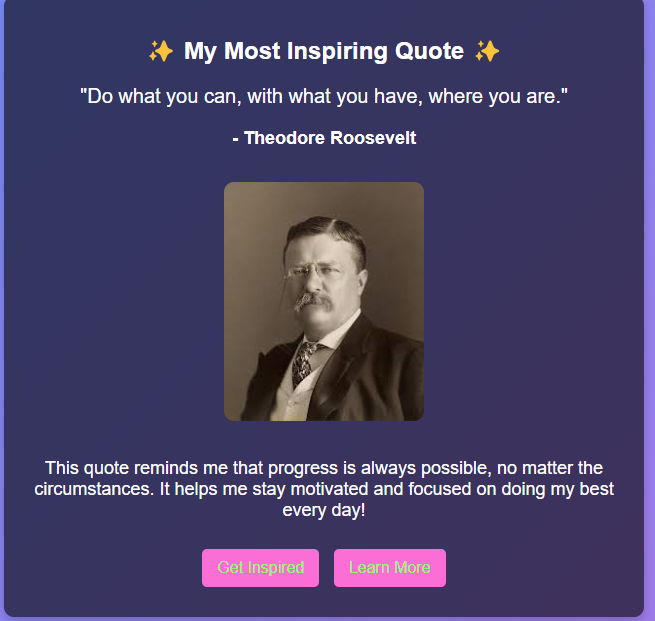

# most-inspiring-quote

## 📌 Description
The Inspiring Quote project is a simple webpage that displays a motivational quote by Theodore Roosevelt. It aims to inspire users by presenting them with a meaningful quote, a reflection on its importance, and a personal reminder to stay motivated. The page includes an image of Theodore Roosevelt and a button that, when clicked, provides an alert to remind the user to stay inspired. Additionally, there is a link to learn more about Theodore Roosevelt via his Wikipedia page.

## 🛠 Prerequisites
N/A

## 📋 Criteria
* Simple, responsive webpage.
* Includes an inspiring quote.
* A personal reflection on the quote.
* Interactive button to encourage the user.
* Links to external resources (Wikipedia).
* Display of the author's image.

 ## 💻 Technologies Used
The application is built with the following technologies:
* HTML
* CSS
* JavaScript
 
## 🚀 Installation
No installation is required to use the app. It is hosted online and can be accessed via a web browser.

## 📚 Usage
1. Open the web application in your browser.
2. When you click the "Get Inspired" button, an alert box will pop up with the message "Stay Inspired!".
3. Click the "Learn More" button to open Theodore Roosevelt’s Wikipedia page.

## 🔗 Live Demo & Repository
Application can be viewed here: 
* [Live](https://ya-most-inspiring-quote.netlify.app/)

* [Repository](https://github.com/yvonnesarah/most-inspiring-quote)

## 🖼 Screenshot
Below is a preview of Most Inspiring Quote:

## 👥 Credit
Theodore Roosevelt for the inspiring quote.
Image used is from SheCodes.

## 📜 License
This project is open-source. For licensing details, please refer to the LICENSE file in the repository.

## 📬 Contact
You can reach me at 📧 yvonneadedeji.sarah@gmail.com.
